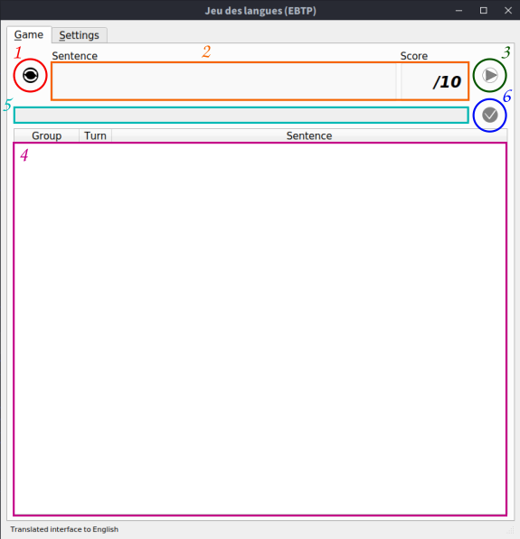
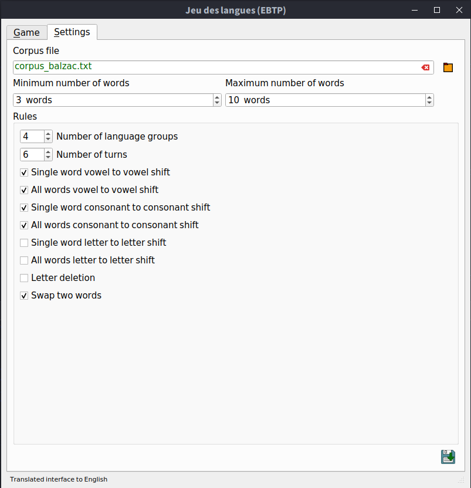

JeuDesLangues is a python3 and PyQt5-based software whose goal is to show the evolution of languages in the form a (hopefully fun) translation game. The only action which requires the player attention is the translation part, everything else is automatically done by the backend part.

The main point is to let the user try to reconstruct as efficiently as possible a mother sentence which has been altered by different _language groups_ played by the computer. 

## Information

### Installation

This software first requires python3. On top of that, a few libraries can be downloaded either with pip or with conda:

Library | Installation | Use
:-      | :-           | :-
[PyQt5](https://www.riverbankcomputing.com/software/pyqt/) | pip install PyQt5           | Create the interface
[nltk](https://www.nltk.org)                               | pip install --user -U nltk  | Process texts/sentences/words from natural languages
[numpy](https://numpy.org/)                                | pip install --user -U numpy | Array computations
[pyyaml](https://pyyaml.org/)                              | pip install pyyaml          | Read and write files in the yaml format

### How to play ?

Playing is quite easy. Here are the (very few) steps to follow __each time__:

* Click the "generate a sentence button" (1) or press Ctrl+R to let the computer draw a sentence from a corpus file. The sentence should appear in (2) hidden from the user with * symbols.
* Click the "play button" (3) or press Ctrl+P to let the computer alter the sentence for each _language group_. You should see in (4) a list of groups, with the turn number and their modified sentence.
* Enter your guess for the mother sentence in (5) and click the "validate button"(6) or press the return key. The mother sentence will become visible in (2) and your sentence will be shown just below, the green parts being the correct words and the red parts the wrong ones. A score from 0 to 10 should also appear right to it.

### Settings

A wide range of settings are available for the user to tweak the diffculty or adapt the game to another language. See the documentation for more technical details on how to add your language to the game.

To play the game, at least one rule must be selected. From experience, the more rules and the least words lead to a larger difficulty. Here is a description of the different settings available:

Setting | Implemented ? | Description
:-      | :-:           | :-
Corpus file                              | Yes | Load a corpus file from which the sentences are drawn
Minimum number of words                  | Yes | Minimum number of words required for a sentence to be drawn
Maximum number of words                  | Yes | Maximum number of words required for a sentence to be drawn
Number of groups                         | Yes | Number of 'language groups the computer will play'
Number of turns                          | Yes | Number of turns the computer will play
Single word vowel to vowel shift         | Yes | Each group picks a vowel in a word and replaces each occurence in the word by another one randomly picked
All words vowel to vowel shift           | Yes | Each group picks a vowel and replaces each occurence in the sentence by another one randomly picked
Single word consonant to consonant shift | Yes | Each group picks a consonant in a word and replaces each occurence in the word by another one randomly picked
All words consonant to consonant shift   | Yes | Each group picks a consonant and replaces each occurence in the sentence by another one randomly picked
Single word letter to letter shift       | No  | Each group picks a letter in a word and replaces each occurence in the word by another one randomly picked
All words letter to letter shift         | No  | Each group picks a letter and replaces each occurence in the sentence by another one randomly picked
Letter deletion                          | No  | Each group picks a letter in a word and removes it
Swap words                               | Yes | Each group picks two consecutive words (except 1st and last) and swap their positions

__Warning:__ _This software is for entertainment purposes only. It is not designed by any means whatsoever to be scientifically acurate. If used in an educational context, then one must understand that its content is very limited and not directly based on any scientific litterature._
