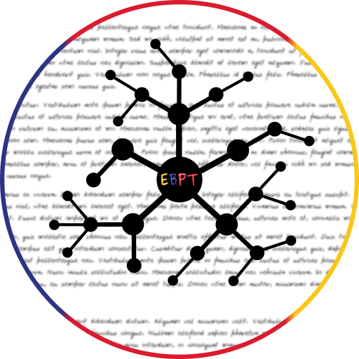

# JeuDesLangues

__Language/Langue:__

* [English/Anglais](#english-translation)
* [French/Français](#traduction-française)

## English translation

JeuDesLangues is a python3-PyQt5-based software whose goal is to show the evolution of languages in the form a (hopefully fun) translation game. The only action which requires the player attention is the translation part, everything else is automatically done by the backend part.

The main point is to let the user try to reconstruct as efficiently as possible a mother sentence which has been altered by different 'language groups' played by the computer. 

### How to play ?

Playing is quite easy. Here are the (very few) steps to follow __each time__:

* Press the __generate sentence button__ (or Ctrl+R) to let the computer draw a sentence from a corpus file. The sentence should appear hidden from the user with * symbols.
* Press the __play button__ (or Ctrl+P) to let the computer alter for each 'language group'. You should see in the table a list of groups, with the turn number and their modified sentence.
* Enter your guess for the mother sentence and press the __validate button__ (or Return key). The mother sentence will become visible and your sentence will be show just below, the green parts being the correct words and the red parts the wrong ones. A score from 0 to 10 should appear right to it.

__Warning:__ _This software is for entertainment purposes only. It is not designed by any means whatsoever to be scientifically acurate. If used in an educational context, then one must understand that its content is very limited and not directly based on any scientific litterature._

## Traduction française

